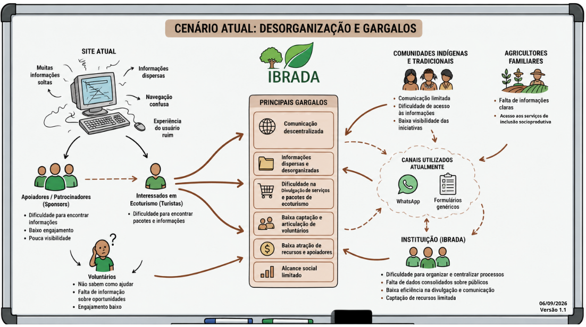
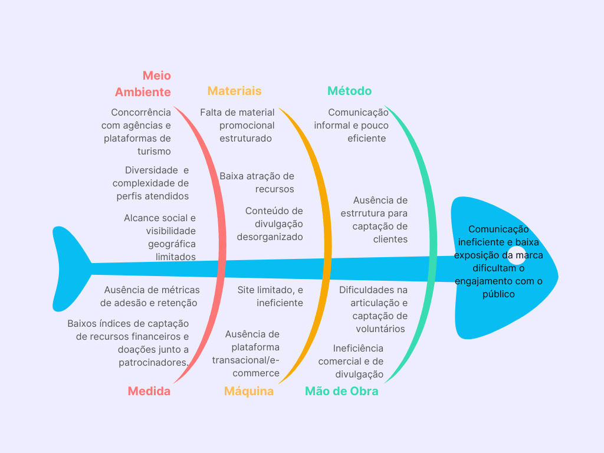
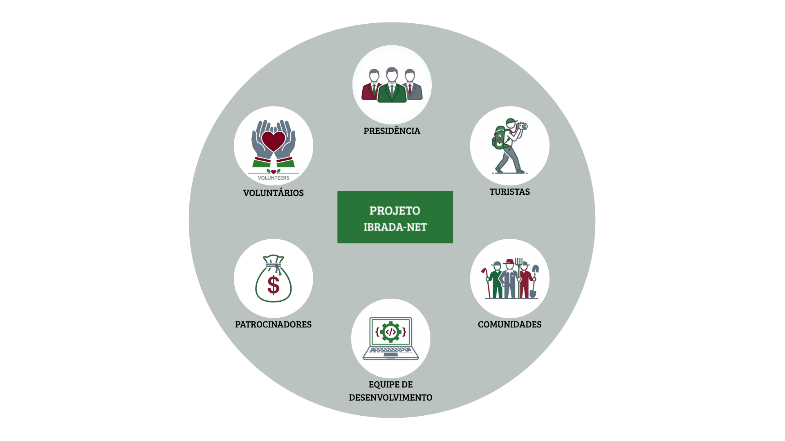

## Controle de versão

|Data|Versão|Descrição| Autor (es)|
|--|--|--|--|
|26/08/2026|0.01|Proposta inicial do produto.|Arthur, Zayra, Gabriel|
|30/08/2026|0.02|Ajustes da proposta|Cauã e Vinícius|
|05/09/2026|0.03|Características de Produto e Tecnologias a serem utilizadas|Zayra Moraes|
|06/09/2026|0.04|Inclusão dos tópicos Intervenção Social e Lições Aprendidas| Cauã Mendes|
|06/09/2026|0.05|Benefícios Esperados| Igor Lima|
|06/09/2026|0.06|Quadro Comparativo do 4.2 | Filipe Brito|
|06/09/2026|0.07|Requisitos e o Rad|Gabriel Guedes|
|06/09/2026|0.08|Composição da Equipe|Igor Lima|
|07/09/2026|0.09|Cronograma final|Zayra Moraes|
|07/09/2026|0.10|Inclusão do tópico Comunicação|Gabriel Guedes|
|07/09/2026|0.11|Inclusão do tópico Atividades e Técnicas de ER| Vinícius dos Santos|
|07/09/2026|0.12|Processo de Validação|Vinícius dos Santos|

*Tabela 1: Tabela de versionamento*

## 1.1 Identificação do Cliente/Parceiro

- **Nome:** Instituto Brasileiro do Direito Ambiental - IBRADA
- **Tipo:** OSCIP (Organização da Sociedade Civil de Interesse Público)
- **Representante:** Guilherme Sampaio Scartezini, Nelson Vicente e Luiz Freitas Jr
- **Forma de contato:** Reuniões remotas via Google Teams
- **Vínculo com o projeto:** Presidência da instituição, será um dos responsáveis por validar requisitos e decisões do projeto.

## 1.2 Introdução ao Negócio e Contexto

O Instituto Brasileiro de Direito Ambiental - IBRADA é uma organização sem fins lucrativos que tem como missão promover a educação, a paz, a ética, a cidadania, o direito e a justiça em defesa da conservação e recuperação do meio ambiente. A dinâmica atual do instituto se concentra principalmente na a inclusão socioprodutiva de comunidades carentes, com foco em soluções de agroecologia e turismo de base comunitária e na venda de pacotes de viagens ou trilhas que promovem o ecoturismo. 

O público-alvo da organização se divide em duas frentes principais de interação:

- Beneficiários/Clientes: Inclui os interessados que pagam pelos pacotes de ecoturismo, as comunidades indígenas e tradicionais (beneficiários não pagantes da inclusão socioprodutiva) e os agricultores familiares (que participam da inclusão socioprodutiva e/ou pagam um valor simbólico pelos serviços de regularização de suas terras).
- Parceiros: Composto por voluntários que colaboram com o trabalho diário, além de apoiadores e patrocinadores responsáveis por injetar recursos financeiros, materiais e equipamentos.	

A estratégia da organização utiliza metodologias participativas para garantir o protagonismo local e adaptar tecnologias sociais e ambientais aos biomas brasileiros. Atualmente, o IBRADA possui um site que limita a instituição, não traz os resultados necessários de engajamento com voluntários, patrocinadores e apoiadores, e não recruta com eficiência os interessados em viagens e trilhas de ecoturismo, somado a isso, as informações se encontram dispersas pelas páginas e links no site, o que gera gargalos significativos. Essa dificuldade impacta a venda de serviços de ecoturismo e a captação de novos clientes para regularização fundiária.

## 1.3 Rich Picture

*Figura 1: Rich Picture. Elaborado por Arthur Scartezini. Modificado por Cauã Mendes e Zayra Moraes*

## 1.4 Identificação da Oportunidade ou Problema

O IBRADA atua em diferentes frentes, como ecoturismo, preservação ambiental e inclusão socioprodutiva. Entretanto, atualmente enfrenta dificuldades para centralizar e organizar a comunicação e o relacionamento com seus diferentes públicos. A atual infraestrutura digital não atende adequadamente às necessidades da organização, enquanto parte significativa da comunicação ocorre por meio de canais informais. Além disso, as informações sobre os serviços e projetos encontram-se dispersas, dificultando o acesso e a compreensão por parte dos interessados. Esse cenário reduz a capacidade do IBRADA de divulgar seus serviços, atrair novos clientes, captar voluntários e apoiadores, e ampliar o alcance de suas iniciativas. Dessa forma, o problema central identificado é: O IBRADA possui dificuldade em centralizar informações, comunicar-se de forma eficiente com seus diferentes públicos e transformar o interesse desses públicos em ações concretas, como contratação de serviços, participação como voluntário e apoio aos projetos da instituição.

A perpetuação desse gargalo digital gera as seguintes consequências diretas para a sustentabilidade da instituição:

- Dificuldades na articulação e captação de voluntários;
- Ineficiência comercial e de divulgação; 
- Baixa atração de recursos;
- Alcance social limitado.

O acúmulo desses problemas compromete a organização interna do instituto, pois a escassez de recursos dificulta a continuidade do trabalho de uma organização sem fins lucrativos. A Figura a seguir, apresenta o diagrama de Ishikawa contendo as causas (organizados pelos 6M’s) e o problema do IBRADA:

*Figura 2: Diagrama de Ishikawa. Elaborado por Vinicius Dos Santos.*

##  1.6 Mapa de Stakeholders 

Os principais stakeholders do projeto são: Guilherme Sampaio Scartezini, Nelson Vicente e Luiz Freitas Jr, representando o cliente na presidência da instituição e sendo os responsáveis diretos por validar os requisitos e entregas do sistema; os interessados em ecoturismo, que atuarão como clientes pagantes consumindo pacotes de viagens e trilhas; as comunidades indígenas e tradicionais e agricultores familiares, caracterizados como beneficiários das iniciativas de inclusão socioprodutiva e serviços de regularização ambiental; os parceiros voluntários, que colaboram com o trabalho diário da organização; os apoiadores e patrocinadores, que injetam recursos financeiros, materiais e equipamentos necessários para a sobrevivência do instituto; e a equipe de desenvolvimento, responsável por viabilizar tecnicamente a centralização das informações em um portal institucional engajador.

*Figura 3:  Mapa de Stakeholders. Elaborado por Igor Lima.*

A seguir, é apresentado um quadro resumo dos stakeholders.

| Stakeholder | Relação com a solução | Interesse principal | Influência |
|:---:|:---:|:---:|:---:|
| Presidência e representantes | Cliente real e stakeholder primordial do projeto | Validar requisitos, decisões e avaliar as entregas realizadas ao longo do desenvolvimento | Alta |
| Interessados em ecoturismo | Usuários finais pagantes dos pacotes e trilhas | Acessar informações de pacotes de ecoturismo e realizar compras com clareza e agilidade | Alta |
| Comunidades indígenas. Tradicionais e agricultores familiares | Beneficiários não pagantes ou pagantes de valores simbólicos | Ter acesso facilitado, com menor burocracia, às informações de iniciativas sociais e serviços de regularização de terras | Média |
| Apoiadores e patrocinadores | Parceiros que injetam recursos financeiros e materiais | Encontrar informações de forma rápida para apoiar os projetos e aumentar a visibilidade de suas ações | Alta |
| Voluntários | Usuários que colaboram com a operação diária | Encontrar informações claras sobre oportunidades de ajuda e engajar-se nos projetos facilmente | Média |
| Equipe de desenvolvimento | Responsável pela construção técnica do sistema | Unificar as funcionalidades para operar a solução digital como um e-commerce e portal institucional seguro e acessível | Alta |

*Tabela 2: Tabela de stakeholders*

## 1.7 Segmentação de Clientes

Dentro do público-alvo do IBRADA temos perfis distintos com necessidades diferentes, entre eles:

* **Interessados em Ecoturismo:** Público pagante que busca adquirir pacotes de viagens ou trilhas que promovem o ecoturismo e experiências imersivas.
* **Comunidades Indígenas e Tradicionais:** Beneficiários diretos e não pagantes. O foco deste segmento é a integração de seus saberes ancestrais com os projetos do IBRADA, focados em agroecologia e preservação ambiental.
* **Voluntários, Patrocinadores e Apoiadores:** Voluntários para o projeto e investidores (pessoas físicas ou empresas) que fornecem recursos financeiros, materiais ou equipamentos. 
* **Agricultores familiares:** Beneficiários da inclusão sócio-produtiva e/ou pagante de valor simbólico do serviço de regularização fundiária.
