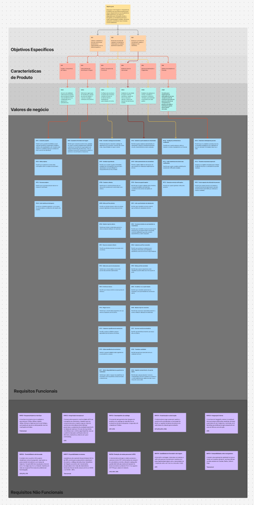

# 8 REQUISITOS DE SOFTWARE

## 8.1 Lista de Requisitos Funcionais

| ID | Nome | Descrição | Relação |
| --- | --- | --- | --- |
| RF01 | Cadastrar projetos | Permitir que os gestores do IBRADA possam cadastrar projetos de regularização fundiária e ambiental de propriedades rurais, inclusão sócio-produtiva e assistência técnica e extensão de áreas rurais em um dashboard. | CP1 |
| RF02 | Editar projetos | Permitir que os gestores possam editar informações sobre os projetos do dashboard. | CP1 |
| RF03 | Remover projetos | Permitir que os gestores possam remover os projetos do dashboard. | CP1 |
| RF04 | Exibir dashboard de impacto | Permitir que visitantes visualizem, em um painel de acesso público, os indicadores de impacto dos projetos. | CP1 |
| RF05 | Apresentar formulário de triagem | Permitir que o visitante (possível turista, apoiador ou usuário buscando regulamentação ambiental) preencha um formulário de triagem guiado com campos simplificados para identificar o tipo de solicitação e seu perfil, armazenando os dados no sistema e o encaminhando corretamente. | CP2 |
| RF06 | Visualizar catálogo de ecoturismo | Permitir aos usuários visualizar o catálogo de experiências de ecoturismo, incluindo descrições, datas, disponibilidade de vagas e valores. | CP3 |
| RF07 | Detalhar experiências | Permitir que o usuário visualize informações completas de uma experiência de ecoturismo selecionada e com possibilidade de compartilhamento de seu conteúdo. | CP3 |
| RF08 | Cadastrar clientes | Permitir que os visitantes interessados em reservas se cadastrem em novas contas como clientes. | CP3 |
| RF09 | Editar perfil de clientes | Permitir que clientes possam editar seus dados pessoais registrados em suas próprias contas. | CP3 |
| RF10 | Realizar login de cliente | Permitir que clientes cadastrados acessem o sistema mediante validação de credenciais. | CP3 |
| RF11 | Encerrar sessão de cliente | Permitir que clientes encerrem sua sessão ativa no sistema. | CP3 |
| RF12 | Selecionar pacote de ecoturismo | Permitir que o cliente realize a reserva dos pacotes de ecoturismo selecionados. | CP3 |
| RF13 | Confirmar reserva | Permitir que o cliente confirme a reserva antes do checkout. | CP3 |
| RF14 | Pagar reserva | Permitir que o cliente realize pagamento de suas reservas de pacotes de ecoturismo. | CP3 |
| RF15 | Cadastrar experiências de ecoturismo | Permitir à equipe do IBRADA cadastrar experiências de ecoturismo no sistema. | CP3 |
| RF16 | Editar experiências de ecoturismo | Permitir à equipe do IBRADA editar experiências de ecoturismo no sistema. | CP3 |
| RF17 | Alterar disponibilidade de experiência de ecoturismo | Permitir que o gestor marque uma experiência de ecoturismo como disponível ou indisponível para novas reservas. | CP3 |
| RF18 | Cadastrar oportunidades de voluntariado | Permitir ao gestor cadastrar oportunidades de voluntariado, definindo habilidades requeridas, duração, disponibilidade e projeto associado. | CP4 |
| RF19 | Editar oportunidades de voluntariado | Permitir ao gestor editar as informações das oportunidades de voluntariado registradas no sistema. | CP4 |
| RF20 | Gerenciar papel de gestor | Permitir que um gestor cadastre outros membros da equipe do IBRADA como gestores, concedendo a eles acesso aos painéis do sistema. | CP4 |
| RF21 | Listar oportunidades de voluntariado | Permitir que o voluntário consulte a lista de oportunidades de voluntariado abertas. | CP4 |
| RF22 | Visualizar detalhes de oportunidade de voluntariado | Permitir que o voluntário visualize as informações detalhadas de uma oportunidade selecionada, incluindo habilidades requeridas, duração, disponibilidade e projeto associado. | CP4 |
| RF23 | Cadastrar perfil do voluntário | Permitir que usuários se cadastrem como voluntários, informando suas habilidades, experiências, áreas de interesse e disponibilidade. | CP4 |
| RF24 | Editar perfil do voluntário | Permitir que usuários cadastrados como voluntários possam editar suas informações do perfil. | CP4 |
| RF25 | Candidatar-se a oportunidade | Permitir que o voluntário autenticado se candidate a uma oportunidade de voluntariado aberta. | CP4 |
| RF26 | Realizar login de voluntário | Permitir que voluntários cadastrados acessem o sistema mediante validação de credenciais. | CP4 |
| RF27 | Encerrar sessão de voluntários | Permitir que voluntários encerrem sua sessão ativa no sistema. | CP4 |
| RF28 | Visualizar candidatos | Permitir que gestores visualizem todos os candidatos a uma oportunidade em funil. | CP4 |
| RF29 | Registrar consentimento de uso de dados | Permitir que o usuário visualize o termo de consentimento (LGPD) no momento do cadastro e o aceite explicitamente, registrando data, hora e versão do termo aceito. | CP4 |
| RF30 | Configurar preferências de notificação | Permitir que o usuário selecione, edite ou desative os alertas de projetos de seu interesse. | CP5 |
| RF31 | Exibir estatísticas de alcance das notificações | Permitir que o gestor visualize estatísticas de alcance das notificações enviadas. | CP5 |
| RF32 | Gerenciar envio de notificações | Permitir que o gestor gerencie notificações enviadas. | CP5 |
| RF33 | Preencher solicitação de parceria | Permitir que um candidato a parceiro preencha um formulário simplificado para solicitação de parceria, coletando informações (data, tipo e área). | CP6 |
| RF34 | Visualizar propostas de parceria | Apresentar um painel centralizado para a equipe do IBRADA visualizar as solicitações de parceria recebidas. | CP6 |
| RF35 | Enviar resposta de solicitação de parceria | Permitir que o gestor escreva uma resposta à solicitação de parceria pelo sistema, que será enviada de forma automática por email para a empresa candidata. | CP6 |

## 8.2 Lista de Requisitos de Negócio

| ID | Nome | Descrição | Relação |
| --- | --- | --- | --- |
| RN01 | Indicadores de impacto | Permitir que gestores atualizem indicadores de impacto para cada projeto. | CP1 |
| RN02 | Filtro do dashboard de impacto | Permitir filtragem do dashboard de impacto por área de atuação, status e período. | CP1 |
| RN03 | Redirecionar para atendimento via WhatsApp | Redirecionar o usuário para o WhatsApp do IBRADA, carregando uma mensagem pré-configurada correspondente às respostas fornecidas na triagem. | CP2 |
| RN04 | Encaminhamento para Departamentos | Se a triagem identificar outro serviço, encaminhar solicitação para um departamento específico, realizando o roteamento interno. | CP2 |
| RN05 | Filtros e busca de experiências | Permitir que o usuário filtre experiências de ecoturismo por critérios. | CP3 |
| RN06 | Pagamento via gateway externo | Os pagamentos realizados no produto deverão utilizar um gateway externo via API, exibindo o status do pagamento. | CP3 |
| RN07 | Detalhes de oportunidade | Disponibilizar uma página com informações completas de uma oportunidade de voluntariado. | CP4 |
| RN08 | Filtros de candidato | Permitir que gestores filtrem candidatos por múltiplos critérios. | CP4 |
| RN09 | Detalhes de candidato | Ao selecionar um candidato, o sistema deve permitir visualizar seu perfil completo. | CP4 |
| RN10 | Notificações a candidato de voluntariado | Enviar notificações por email automaticamente aos usuários cadastrados que correspondam aos interesses declarados em seus perfis. | CP5 |
| RN11 | Notificação de novo projeto | Notificar o apoiador quando um novo projeto relacionado à sua área de interesse for lançado. | CP5 |
| RN12 | Detalhe de solicitação | Permitir a visualização das informações completas de uma solicitação de parceria. | CP6 |

## 8.3 Lista de Requisitos Não Funcionais

| ID | Nome | Descrição | Classificação URPS+ | Relação |
| --- | --- | --- | --- | --- |
| RNF01 | Responsividade da interface | A interface do sistema deve se adaptar a smartphones (320px-480px), tablets (481px-1024px) e desktops (acima de 1024px), sem quebra de layout ou sobreposição nos três breakpoints definidos. | Portabilidade | Transversal (Todas as CPs) |
| RNF02 | Integridade transacional | O sistema deve garantir a conformidade ACID nas transações de ecoturismo e impedir reservas concorrentes para a mesma vaga por meio de controle de concorrência (lock otimista/pessimista e constraints de unicidade/capacidade na tabela de reservas). Em caso de requisições simultâneas para a última vaga disponível, apenas a primeira transação confirmada deve ser efetivada, rejeitando as demais sem gerar overbooking. | Confiabilidade | CP3 |
| RNF03 | Desempenho do catálogo | O tempo de carregamento das listagens de projetos e do catálogo de experiências de ecoturismo não deve ultrapassar 3 segundos em conexão de 15 Mbps. | Performance | CP1, CP3 |
| RNF04 | Autenticação e autorização | O sistema deve negar acesso por padrão a usuários não autenticados ou sem papel de Gestor, e registrar tentativas de acesso não autorizadas às rotas de gerenciamento. | + (Segurança) | Transversal (CP1, CP3, CP4, CP6) |
| RNF05 | Integração Externa | A interface de integração externa via webhook deve processar notificações recebidas de forma assíncrona em até 3 segundos, realizando até 5 tentativas automáticas de reprocessamento em caso de falha na comunicação. | + (Interfaces) | CP3 |
| RNF06 | Escalabilidade sob demanda | O sistema deve suportar 200 usuários simultâneos ativos (navegando, reservando ou preenchendo formulários), com tempo de resposta ≤ 2s para 95% das requisições e taxa de erro ≤ 1% (respostas 5xx ou timeout), medidos em teste de carga de 10 minutos em ambiente de homologação. | Performance / Suportabilidade | CP1, CP3, CP5 |
| RNF07 | Disponibilidade do sistema | A plataforma deve garantir disponibilidade mínima de 98% ao mês para acesso público (dashboard de projetos, catálogo de ecoturismo, formulários de triagem e parceria), com manutenções programadas com 2 dias de antecedência realizadas fora do horário de pico (entre as 02h00 e as 05h00 - BRT). | Confiabilidade | Transversal (Todas as CPs) |
| RNF08 | Proteção de dados pessoais (LGPD) | O sistema deve proteger os dados pessoais e sensíveis (como CPF e informações de contato) de voluntários e clientes utilizando criptografia padrão AES-256 para dados em repouso no banco de dados e protocolo TLS 1.2 ou superior (HTTPS) para dados em trânsito. | + (Legal/Segurança) | CP3, CP4, CP6 |
| RNF09 | Usabilidade do formulário de triagem | O formulário de triagem inicial deve ser simples o suficiente para ser concluído por usuários com baixa familiaridade digital, sem a necessidade de criação de conta, com taxa de conclusão ≥ 90%. | Usabilidade | CP2 |
| RNF10 | Compatibilidade entre navegadores | O sistema deve apresentar paridade funcional e visual, sem quebras de layout, nas duas últimas versões estáveis do Chrome, Firefox, Safari e Edge. | Suportabilidade | Transversal (Todas as CPs) |

## 8.4 Matriz de Rastreabilidade

| Contribuição Principal | CP | VN | RFs/RNs | RNFs |
| --- | --- | --- | --- | --- |
| OE1 | CP1 | VN01 | RF01, RF02, RF03, RF04, RN01, RN02 | RNF01, RNF03, RNF04, RNF06, RNF07, RNF10 |
| OE1 | CP2 | VN02 | RF05, RN03, RN04 | RNF01, RNF07, RNF09, RNF10 |
| OE2 | CP3 | VN03 | RF06, RF07, RF08, RF09, RF10, RF11, RF12, RF13, RF14, RF15, RF16, RF17, RN05, RN06 | RNF01, RNF02, RNF03, RNF04, RNF05, RNF06, RNF07, RNF08, RNF10 |
| OE3 | CP4 | VN04 | RF18, RF19, RF20, RF21, RF22, RF23, RF24, RF25, RF26, RF27, RF28, RF29, RN07, RN08, RN09 | RNF01, RNF04, RNF07, RNF08, RNF10 |
| OE2 | CP5 | VN05 | RF30, RF31, RF32, RN10, RN11 | RNF01, RNF06, RNF07, RNF10 |
| OE1 | CP6 | VN06 | RF33, RF34, RF35, RN12 | RNF01, RNF04, RNF07, RNF08, RNF10 |

## 8.5 Árvore de Rastreabilidade

- Imagem para controle de versão

- Link interativo

<iframe style="border: 1px solid rgba(0, 0, 0, 0.1);" width="800" height="450" src="https://embed.figma.com/board/kxAD4nuFXL6o56GWf61CdO/Guerreiros-do-Backlog?node-id=0-1&embed-host=share" allowfullscreen></iframe>

> [Link da árvore de rastreabilidade](https://www.figma.com/board/Onc9sxunGlXpjNQXJqnAMF/Matriz-de-prioridade?node-id=0-1&t=4aifg0Jj2s4gHz3E-1)