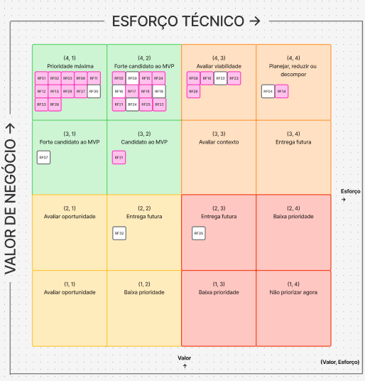

# Atividade 4 - Priorização dos requisitos e definição do MVP

## 1. Avaliação do valor de negócio

Durante a [reunião](../atas-reuniao/ata2.md) foi apurado a pontuação de valor de negócio baseado na medida **MoSCoW** adaptado de 1 a 4 juntamente ao cliente.

### 1.1 Critérios e escala de avaliação

| Pontuação | Classificação | Interpretação |
| --- | --- | --- |
| **4** | Must have | Requisito indispensável para atender uma necessidade central do IBRADA, viabilizar um fluxo principal do produto, atender obrigação relevante ou permitir o funcionamento de outras funcionalidades. |
| **3** | Should have | Requisito importante e com impacto significativo, mas cuja ausência temporária não impede o funcionamento dos principais fluxos do produto. |
| **2** | Could have | Requisito que agrega valor à solução, porém pode ser implementado posteriormente sem comprometer os objetivos principais da primeira versão. |
| **1** | Won't have now | Requisito de baixo valor para o momento atual, podendo ser planejado para versões futuras sem impacto relevante sobre o funcionamento inicial da solução. |

### 1.2 Avaliação dos Requisitos Funcionais

| Código | Requisito | Relação | Valor de negócio | Classificação | Justificativa do cliente |
| --- | --- | --- | ---: | --- | --- |
| RF01 | Cadastrar projetos | CP1 | **4** | Must have | É uma funcionalidade interessante para os gestores e para o público. |
| RF02 | Editar projetos | CP1 | **4** | Must have | É uma funcionalidade interessante para os gestores, complementar ao RF01. |
| RF03 | Remover projetos | CP1 | **4** | Must have | É uma funcionalidade interessante para os gestores, complementar ao RF01. |
| RF04 | Exibir dashboard de impacto | CP1 | **4** | Must have | É uma funcionalidade interessante para os gestores e para o público. |
| RF05 | Apresentar formulário de triagem | CP2 | **4** | Must have | Acelera o processo de comunicação. |
| RF06 | Visualizar catálogo de ecoturismo | CP3 | **4** | Must have | É a forma da instituição iniciar a oferta de pacotes de ecoturismo e beneficiar os agricultores relacionados. |
| RF07 | Detalhar experiências | CP3 | **3** | Should have | Atualmente já existem vídeos das trilhas que podem ser inseridos como conteúdo. Também seria um bom trabalho para voluntários. |
| RF08 | Cadastrar clientes | CP3 | **4** | Must have | É fundamental, pois o ecoturista possui o perfil de cliente do IBRADA. |
| RF09 | Editar perfil de clientes | CP3 | **4** | Must have | É fundamental, pois o ecoturista possui o perfil de cliente do IBRADA. |
| RF10 | Realizar login de cliente | CP3 | **4** | Must have | Complementar ao cadastro do cliente. |
| RF11 | Encerrar sessão de cliente | CP3 | **4** | Must have | Complementar ao cadastro do cliente. |
| RF12 | Selecionar pacote de ecoturismo | CP3 | **4** | Must have | Antes da compra, é essencial realizar a reserva do cliente. |
| RF13 | Confirmar reserva | CP3 | **4** | Must have | O cliente deve poder verificar as informações antes de concluir sua reserva. |
| RF14 | Pagar reserva | CP3 | **4** | Must have | É a primeira ligação comercial que o cliente terá com o IBRADA. |
| RF15 | Cadastrar experiências de ecoturismo | CP3 | **4** | Must have | É importante para que a equipe do IBRADA possa cadastrar novas experiências planejadas. |
| RF16 | Editar experiências de ecoturismo | CP3 | **4** | Must have | Caso similar ao RF15. |
| RF17 | Alterar disponibilidade de experiência de ecoturismo | CP3 | **4** | Must have | Sempre há um limite de vagas para as experiências. |
| RF18 | Cadastrar oportunidades de voluntariado | CP4 | **4** | Must have | Sem o cadastro das oportunidades, não é possível iniciar o relacionamento entre o IBRADA e o voluntário. É uma porta de entrada para esse relacionamento. |
| RF19 | Editar oportunidades de voluntariado | CP4 | **4** | Must have | É importante porque as oportunidades podem sofrer alterações após serem publicadas. |
| RF20 | Gerenciar papel de gestor | CP4 | **4** | Must have | Dependendo do envolvimento do usuário com as operações do IBRADA, é importante ampliar seu acesso às operações do sistema quando necessário. |
| RF21 | Listar oportunidades de voluntariado | CP4 | **4** | Must have | Caso similar ao RF18, sendo importante para estabelecer o relacionamento com os voluntários. |
| RF22 | Visualizar detalhes de oportunidade de voluntariado | CP4 | **4** | Must have | Caso similar à necessidade de detalhamento presente no RF06. |
| RF23 | Cadastrar perfil do voluntário | CP4 | **4** | Must have | Importante para que os gestores possam analisar de forma ágil possíveis voluntários. |
| RF24 | Editar perfil do voluntário | CP4 | **4** | Must have | Caso similar ao RF09. |
| RF25 | Candidatar-se a oportunidade | CP4 | **4** | Must have | É uma expectativa do voluntário poder se candidatar a uma oportunidade disponível. |
| RF26 | Realizar login de voluntário | CP4 | **4** | Must have | Complementar ao cadastro de voluntário. |
| RF27 | Encerrar sessão de voluntários | CP4 | **4** | Must have | Complementar ao cadastro de voluntário. |
| RF28 | Visualizar candidatos | CP4 | **4** | Must have | É um facilitador para a equipe do IBRADA durante a análise dos candidatos. |
| RF29 | Registrar consentimento de uso de dados | CP4 | **4** | Must have | Trata-se de uma exigência legal relacionada ao tratamento de dados pessoais. |
| RF30 | Configurar preferências de notificação | CP5 | **4** | Must have | O usuário deve poder modificar suas preferências e decidir quais notificações deseja receber. |
| RF31 | Exibir estatísticas de alcance das notificações | CP5 | **3** | Should have | É importante para que a equipe do IBRADA possa analisar o alcance e o processo de comunicação dos projetos. |
| RF32 | Gerenciar envio de notificações | CP5 | **2** | Could have | É uma funcionalidade interessante, mas pode ser implementada posteriormente. |
| RF33 | Preencher solicitação de parceria | CP6 | **4** | Must have | O IBRADA não trabalha apenas com clientes, mas também com parceiros. É importante possuir um contato inicial organizado com potenciais parceiros. |
| RF34 | Visualizar propostas de parceria | CP6 | **4** | Must have | É essencial para que a equipe do IBRADA possa visualizar e analisar as possíveis parcerias. |
| RF35 | Enviar resposta de solicitação de parceria | CP6 | **2** | Could have | É uma funcionalidade interessante, mas não é necessária em todos os casos. |

A avaliação do cliente demonstrou uma concentração dos requisitos na categoria **Must have**, refletindo a percepção de que grande parte das funcionalidades contribui diretamente para os principais fluxos da solução.

Nenhum requisito recebeu valor de negócio **1 — Won't have now** nesta avaliação.

## 2. Avaliação do Esforço Técnico

A avaliação técnica dos requisitos funcionais foi realizada pela equipe do projeto considerando três critérios: **esforço necessário para implementação**, **complexidade técnica** e **lacuna de capacidade da equipe**.

Cada critério foi avaliado em uma escala de **1 a 4**, orientada de modo que valores maiores representem maior dificuldade para implementação.

### 2.1 Critérios e escalas de avaliação

=== "Esforço de implementação"

    | Pontuação | Interpretação | Descrição |
    | --- | --- | --- |
    | **1** | Esforço baixo | Até 2 horas |
    | **2** | Esforço moderado | Entre 2 e 6 horas |
    | **3** | Esforço alto | Entre 6 e 12 horas |
    | **4** | Esforço muito alto | Mais de 12 horas |

=== "Complexidade técnica"

    | Pontuação | Interpretação |
    | --- | --- |
    | **1** | Utiliza solução conhecida, com poucas dependências |
    | **2** | Exige alguma investigação ou integração |
    | **3** | Possui várias dependências ou incertezas técnicas |
    | **4** | Apresenta elevada incerteza, integração crítica ou tecnologia não dominada |

=== "Capacidade da equipe"

    | Pontuação | Interpretação |
    | --- | --- |
    | **1** | A equipe domina plenamente os conhecimentos necessários |
    | **2** | A equipe possui conhecimento suficiente, com pouca aprendizagem adicional |
    | **3** | A equipe precisa desenvolver conhecimentos relevantes |
    | **4** | A equipe ainda não possui os conhecimentos ou recursos necessários |

- Consolidação do esforço técnico

Para consolidar os três critérios em uma única medida, foi utilizada a média aritmética:

**Esforço técnico = (Esforço + Complexidade + Lacuna de capacidade) / 3**

O resultado é apresentado em escala de **1 a 4**, mantendo uma casa decimal quando necessário.

## 3. Consolidação das Avaliações

Após a avaliação do **valor de negócio**, realizada com a participação do cliente, e da avaliação do **esforço técnico**, realizada pela equipe do projeto, os resultados foram reunidos em uma única tabela.

| Código | Requisito | Relação | Esforço | Complexidade | Lacuna de capacidade | Esforço técnico consolidado |
| --- | --- | --- | ---: | ---: | ---: | ---: |
| RF01 | Cadastrar projetos | CP1 | 1 | 1 | 2 | **1,3** |
| RF02 | Editar projetos | CP1 | 1 | 1 | 2 | **1,3** |
| RF03 | Remover projetos | CP1 | 1 | 1 | 2 | **1,3** |
| RF04 | Exibir dashboard de impacto | CP1 | 4 | 3 | 4 | **3,6** |
| RF05 | Apresentar formulário de triagem | CP2 | 2 | 2 | 2 | **2,0** |
| RF06 | Visualizar catálogo de ecoturismo | CP3 | 2 | 1 | 1 | **1,3** |
| RF07 | Detalhar experiências | CP3 | 2 | 1 | 1 | **1,3** |
| RF08 | Cadastrar clientes | CP3 | 3 | 3 | 2 | **2,6** |
| RF09 | Editar perfil de clientes | CP3 | 2 | 2 | 2 | **2,0** |
| RF10 | Realizar login de cliente | CP3 | 3 | 3 | 2 | **2,6** |
| RF11 | Encerrar sessão de cliente | CP3 | 1 | 1 | 1 | **1,0** |
| RF12 | Selecionar pacote de ecoturismo | CP3 | 2 | 1 | 1 | **1,3** |
| RF13 | Confirmar reserva | CP3 | 1 | 1 | 1 | **1,0** |
| RF14 | Pagar reserva | CP3 | 4 | 4 | 4 | **4,0** |
| RF15 | Cadastrar experiências de ecoturismo | CP3 | 2 | 2 | 2 | **2,0** |
| RF16 | Editar experiências de ecoturismo | CP3 | 2 | 2 | 2 | **2,0** |
| RF17 | Alterar disponibilidade de experiência de ecoturismo | CP3 | 1 | 2 | 2 | **1,6** |
| RF18 | Cadastrar oportunidades de voluntariado | CP4 | 2 | 2 | 2 | **2,0** |
| RF19 | Editar oportunidades de voluntariado | CP4 | 2 | 2 | 2 | **2,0** |
| RF20 | Gerenciar papel de gestor | CP4 | 3 | 3 | 2 | **2,6** |
| RF21 | Listar oportunidades de voluntariado | CP4 | 1 | 2 | 2 | **1,6** |
| RF22 | Visualizar detalhes de oportunidade de voluntariado | CP4 | 2 | 2 | 1 | **1,7** |
| RF23 | Cadastrar perfil do voluntário | CP4 | 3 | 3 | 2 | **2,6** |
| RF24 | Editar perfil do voluntário | CP4 | 2 | 2 | 2 | **2,0** |
| RF25 | Candidatar-se a oportunidade | CP4 | 2 | 2 | 2 | **2,0** |
| RF26 | Realizar login de voluntário | CP4 | 3 | 3 | 2 | **2,6** |
| RF27 | Encerrar sessão de voluntários | CP4 | 1 | 1 | 1 | **1,0** |
| RF28 | Visualizar candidatos | CP4 | 2 | 1 | 1 | **1,3** |
| RF29 | Registrar consentimento de uso de dados | CP4 | 1 | 1 | 1 | **1,0** |
| RF30 | Configurar preferências de notificação | CP5 | 1 | 1 | 1 | **1,0** |
| RF31 | Exibir estatísticas de alcance das notificações | CP5 | 2 | 2 | 3 | **2,3** |
| RF32 | Gerenciar envio de notificações | CP5 | 1 | 2 | 2 | **1,6** |
| RF33 | Preencher solicitação de parceria | CP6 | 1 | 1 | 1 | **1,0** |
| RF34 | Visualizar propostas de parceria | CP6 | 2 | 2 | 1 | **1,6** |
| RF35 | Enviar resposta de solicitação de parceria | CP6 | 3 | 3 | 3 | **3,0** |

## 4. Construção da matriz 4 × 4

Após a consolidação das avaliações de valor de negócio e esforço técnico, os requisitos funcionais foram posicionados em uma matriz **4 × 4**, permitindo visualizar conjuntamente a importância de cada requisito para o negócio e o esforço necessário para sua implementação.

Para o posicionamento no eixo horizontal, o esforço técnico consolidado foi convertido para a escala de 1 a 4 conforme o valor obtido na avaliação técnica:

| Esforço técnico consolidado | Posição na matriz |
| --- | --- |
| 1,0 a 1,4 | **1 — Baixo** |
| 1,5 a 2,4 | **2 — Moderado** |
| 2,5 a 3,4 | **3 — Alto** |
| 3,5 a 4,0 | **4 — Muito alto** |

O eixo vertical representa o **valor de negócio**, avaliado junto ao cliente, enquanto o eixo horizontal representa o **esforço técnico**, avaliado pela equipe.

| **Valor de negócio ↓ / Esforço técnico →** | **1 — Baixo** | **2 — Moderado** | **3 — Alto** | **4 — Muito alto** |
| --- | --- | --- | --- | --- |
| **4 — Muito alto** | RF01, RF02, RF03, RF06, RF11, RF12, RF13, RF27, RF28, RF29, RF30, RF33 | RF05, RF09, RF15, RF16, RF17, RF18, RF19, RF21, RF22, RF24, RF25, RF34 | RF08, RF10, RF20, RF23, RF26 | RF04, RF14 |
| **3 — Alto** | RF07 | RF31 | — | — |
| **2 — Moderado** | — | RF32 | RF35 | — |
| **1 — Baixo** | — | — | — | — |

<iframe style="border: 1px solid rgba(0, 0, 0, 0.1);" width="800" height="450" src="https://embed.figma.com/board/Onc9sxunGlXpjNQXJqnAMF/Matriz-de-prioridade?node-id=0-1&embed-host=share" allowfullscreen></iframe>

> Em rosa são os que posteriormente entraram no MVP do produto.

> imagem abaixo para controle de versão (última atualização 28/09/2026)

A matriz será utilizada como apoio à definição do MVP, em conjunto com a análise das dependências entre requisitos, formação de fluxos completos de uso, riscos técnicos, prazo disponível e manifestação do cliente.

## 5. Definição dos RFs do MVP

Após a construção da matriz de **valor de negócio × esforço técnico**, foi realizada uma seleção preliminar dos requisitos funcionais que poderão compor o MVP.

A seleção não considerou apenas a posição individual dos requisitos na matriz. Também foram analisados outros quesitos. Dessa forma, requisitos de maior esforço não foram automaticamente descartados quando necessários para completar um fluxo essencial do sistema.

| CP | RFs preliminares | Justificativa |
| --- | --- | --- |
| **Gestão e Transparência de Projetos** | RF01, RF02, RF03 | Os três requisitos permitem que os gestores realizem a manutenção básica dos projetos, possibilitando cadastrar, editar e remover informações. Todos possuem **valor de negócio 4** e **esforço técnico consolidado 1,3**, estando no quadrante de prioridade máxima da matriz. |
| **Canal Unificado de Atendimento e Triagem** | RF05 | O requisito permite receber a necessidade apresentada pelo visitante e realizar seu encaminhamento inicial. Possui **valor de negócio 4** e **esforço técnico 2,0**, posicionando-se como forte candidato ao MVP. |
| **Módulo Transacional de Ecoturismo** | RF06, RF08, RF10, RF11, RF12, RF13, RF14, RF15, RF17 | O conjunto forma um fluxo mínimo envolvendo **cadastro da experiência → visualização → cadastro do cliente → autenticação → seleção → confirmação da reserva → pagamento**. A maior parte dos requisitos possui valor de negócio 4 e está em quadrantes favoráveis à entrada no MVP. O **RF14 — Pagar reserva**, apesar de possuir esforço técnico 4, foi mantido preliminarmente por fazer parte do fluxo transacional considerado importante pelo cliente. |
| **Gestão do Ciclo de Voluntariado** | RF18, RF21, RF22, RF23, RF25, RF26, RF27, RF28, RF29 | O conjunto permite estabelecer um fluxo mínimo de **cadastro da oportunidade → descoberta da oportunidade → cadastro do perfil → autenticação → candidatura → visualização dos candidatos pelo gestor**, incluindo o registro de consentimento de uso de dados. |
| **Sistema de Notificações e Engajamento** | RF31 | O módulo de notificações apresenta menor participação no MVP preliminar, pois não é necessário para viabilizar os principais fluxos de projetos, ecoturismo, voluntariado e parcerias. O RF31 foi mantido como possibilidade preliminar por possuir **valor de negócio 3** e **esforço técnico 2,3**, devendo sua permanência ser avaliada conforme a capacidade disponível da equipe. |
| **Gestão de Solicitações de Parcerias** | RF33, RF34 | Os dois requisitos estabelecem o fluxo mínimo em que **o parceiro envia uma solicitação → a equipe do IBRADA visualiza a proposta recebida**. RF33 possui **valor 4 e esforço 1,0**, enquanto RF34 possui **valor 4 e esforço 1,6**, tornando o fluxo compatível com a proposta do MVP. |

### Requisitos não selecionados para o MVP preliminar

Os requisitos abaixo não foram selecionados neste primeiro recorte do MVP. A exclusão não significa que eles não possuam valor para o produto, mas que podem ser postergados sem inviabilizar os fluxos mínimos definidos nesta etapa.

| RF | Requisito | Valor de negócio | Esforço técnico | Justificativa para não inclusão no MVP preliminar |
| --- | --- | ---: | ---: | --- |
| **RF04** | Exibir dashboard de impacto | 4 | 3,6 | Apesar do alto valor de negócio, possui um dos maiores esforços técnicos da lista. Na matriz, requisitos de valor 4 e esforço muito alto devem ter sua viabilidade analisada, podendo ser reduzidos ou decompostos. A funcionalidade pode ser incorporada após a estrutura básica de gestão dos projetos. |
| **RF07** | Detalhar experiências | 3 | 1,3 | Possui baixo esforço, mas valor de negócio 3. A visualização inicial das experiências já é possibilitada pelo RF06, permitindo que detalhes adicionais e mecanismos de compartilhamento sejam incorporados posteriormente. |
| **RF09** | Editar perfil de clientes | 4 | 2,0 | Apesar do valor de negócio alto e do esforço moderado, não é indispensável para validar inicialmente o fluxo de cadastro, autenticação e reserva do cliente. |
| **RF16** | Editar experiências de ecoturismo | 4 | 2,0 | Possui valor 4 e esforço moderado, porém o RF15 já permite o cadastro inicial das experiências necessárias para validar o fluxo. A edição pode ser incorporada posteriormente. |
| **RF19** | Editar oportunidades de voluntariado | 4 | 2,0 | Possui valor de negócio 4, porém o RF18 já permite cadastrar oportunidades e iniciar a validação do processo de voluntariado. A edição das oportunidades pode ser acrescentada em uma entrega posterior. |
| **RF20** | Gerenciar papel de gestor | 4 | 2,6 | Possui alto valor de negócio, mas esforço técnico elevado em relação a outros requisitos selecionados. No MVP preliminar, o fluxo pode operar inicialmente com gestores previamente definidos, adiando o gerenciamento dinâmico dos papéis. |
| **RF24** | Editar perfil do voluntário | 4 | 2,0 | Embora possua valor 4, o cadastro do perfil por meio do RF23 é suficiente para testar inicialmente o fluxo de candidatura do voluntário. |
| **RF30** | Configurar preferências de notificação | 4 | 1,0 | Apesar do alto valor de negócio e baixo esforço técnico, depende de um fluxo de notificações mais completo. Como esse módulo não é central aos principais fluxos selecionados para o MVP, sua implementação pode acompanhar a evolução posterior do sistema de notificações. |
| **RF32** | Gerenciar envio de notificações | 2 | 1,6 | Possui valor de negócio 2 e foi considerado pelo cliente uma funcionalidade que pode ser adiada. Dessa forma, mesmo apresentando esforço técnico moderado, perde prioridade em relação aos principais fluxos do produto. |
| **RF35** | Enviar resposta de solicitação de parceria | 2 | 3,0 | O cliente indicou que a resposta automática é interessante, porém não necessária em todos os casos. Além disso, o requisito apresenta esforço técnico alto, enquanto RF33 e RF34 já possibilitam um fluxo mínimo de envio e visualização das solicitações de parceria. |

### 5.3 Composição preliminar do MVP

A seleção preliminar resulta em **25 requisitos funcionais incluídos no MVP** e **10 requisitos direcionados inicialmente para entregas posteriores**.

Os requisitos preliminarmente selecionados são:

**RF01, RF02, RF03, RF05, RF06, RF08, RF10, RF11, RF12, RF13, RF14, RF15, RF17, RF18, RF21, RF22, RF23, RF25, RF26, RF27, RF28, RF29, RF31, RF33 e RF34.**

Os requisitos inicialmente deixados para entregas futuras são:

**RF04, RF07, RF09, RF16, RF19, RF20, RF24, RF30, RF32 e RF35.**

## 6. Tratamento dos RNFs

Os requisitos não funcionais foram analisados separadamente dos requisitos funcionais, uma vez que não são posicionados individualmente na matriz de **valor de negócio × esforço técnico**.

Para determinar sua aplicação ao MVP, os RNFs foram classificados nas seguintes categorias:

- **Obrigatório para o MVP:** necessário para garantir segurança, privacidade, legislação, operação ou um nível mínimo de qualidade do produto;
- **Associado a RFs do MVP:** aplicável diretamente a uma ou mais funcionalidades selecionadas para o MVP;
- **Evolutivo:** requisito cuja implementação ou nível de atendimento pode ser aprimorado em entregas posteriores;
- **Não aplicável ao MVP:** relacionado exclusivamente a funcionalidades que não fazem parte do escopo definido para o MVP.

A análise considerou os RFs preliminarmente selecionados, as CPs às quais cada RNF está relacionado e a necessidade de garantir condições mínimas de segurança, confiabilidade e utilização da solução.

### 6.1 Classificação dos RNFs

| RNF | Requisito | Tratamento no MVP | RFs / CPs relacionados | Justificativa |
| --- | --- | --- | --- | --- |
| **RNF01** | Responsividade da interface | **Obrigatório para o MVP** | Transversal — todas as CPs | A responsividade constitui uma condição mínima de utilização da aplicação nos três grupos de dispositivos definidos pelo requisito: smartphones, tablets e desktops. |
| **RNF02** | Integridade transacional | **Associado a RFs do MVP** | RF12, RF13, RF14 / CP3 | O fluxo de reserva e pagamento faz parte do MVP. Portanto, é necessário impedir reservas concorrentes para uma mesma vaga e evitar situações de overbooking ou inconsistência na disponibilidade. |
| **RNF03** | Desempenho do catálogo | **Associado a RFs do MVP** | RF06 / CP1, CP3 | O catálogo de experiências de ecoturismo está presente no MVP por meio do RF06. Dessa forma, o limite de carregamento definido pelo RNF deve ser considerado nessa funcionalidade. A parte referente às listagens públicas de projetos deverá acompanhar a evolução desse fluxo. |
| **RNF04** | Autenticação e autorização | **Obrigatório para o MVP** | CP1, CP3, CP4 e CP6 | O MVP possui funcionalidades destinadas aos gestores e funcionalidades destinadas ao público. Portanto, é necessário restringir as rotas de gerenciamento a usuários autenticados e autorizados como Gestor. |
| **RNF05** | Integração Externa | **Associado a RFs do MVP** | RF14 / CP3 | O pagamento de reservas foi selecionado para o MVP e envolve integração externa. Dessa forma, o processamento das notificações recebidas via webhook e o tratamento de falhas dessa comunicação devem acompanhar esse fluxo. |
| **RNF06** | Escalabilidade sob demanda | **Evolutivo** | CP1, CP3 e CP5 | A capacidade de suportar 200 usuários simultâneos, mantendo os limites definidos de tempo de resposta e taxa de erro, poderá ser avaliada e aprimorada em entregas posteriores conforme o crescimento da utilização do produto. |
| **RNF07** | Disponibilidade do sistema | **Obrigatório para o MVP** | Transversal — todas as CPs | Como o MVP disponibilizará funcionalidades públicas, a disponibilidade mínima estabelecida para a plataforma deve ser considerada desde sua implantação. O requisito também define as condições para realização de manutenções programadas. |
| **RNF08** | Proteção de dados pessoais (LGPD) | **Obrigatório para o MVP** | CP3, CP4 e CP6 | O MVP realiza coleta e armazenamento de dados de clientes, voluntários e usuários envolvidos nos fluxos selecionados. Portanto, os mecanismos de proteção dos dados em repouso e em trânsito devem estar presentes desde a primeira versão. |
| **RNF09** | Usabilidade do formulário de triagem | **Associado a RFs do MVP** | RF05 / CP2 | O formulário de triagem faz parte do MVP. Dessa forma, devem ser observadas as condições de utilização definidas pelo RNF, incluindo a possibilidade de preenchimento sem criação de conta e a meta estabelecida de conclusão do formulário. |
| **RNF10** | Compatibilidade entre navegadores | **Obrigatório para o MVP** | Transversal — todas as CPs | O MVP deve manter funcionamento e apresentação equivalentes nas duas últimas versões estáveis dos navegadores definidos no requisito: Chrome, Firefox, Safari e Edge. |

### 6.2 RNFs aplicáveis ao MVP

Com base na análise realizada, os RNFs foram agrupados da seguinte forma:

| Classificação | RNFs |
| --- | --- |
| **Obrigatórios para o MVP** | RNF01, RNF04, RNF07, RNF08, RNF10 |
| **Associados a RFs do MVP** | RNF02, RNF03, RNF05, RNF09 |
| **Evolutivos** | RNF06 |
| **Não aplicáveis ao MVP** | Nenhum |

Todos os requisitos não funcionais possuem alguma relação com funcionalidades ou características de produto presentes no MVP. Por esse motivo, **nenhum RNF foi classificado como não aplicável**.

## 7. Validação do MVP

Infelizmente a validação não foi possível ser realizada ainda. Como as atividades foram enviadas na última semana só conseguimos uma reunião com cliente. 

Ainda pretendemos finalizar a validação do MVP na nossa próxima reunião no dia (04/10/2026).