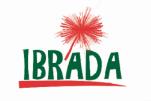
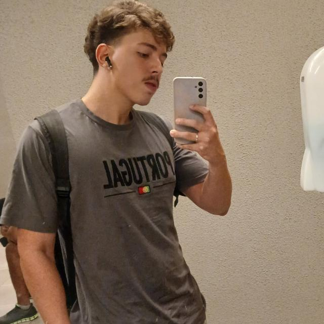
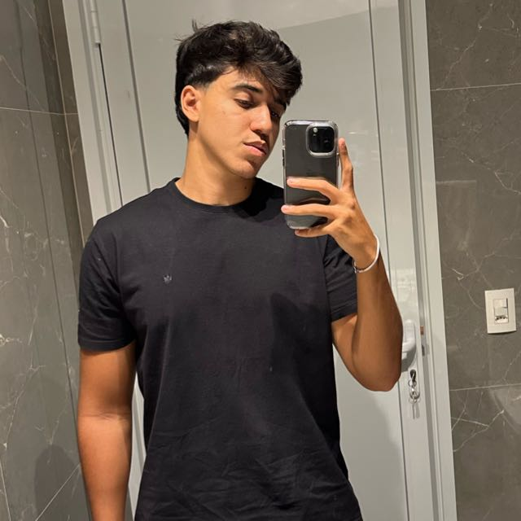
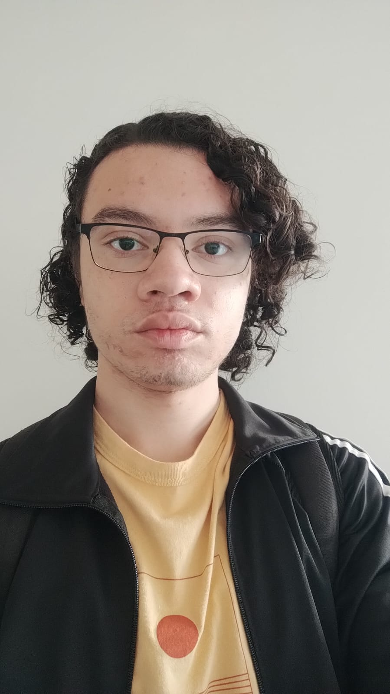
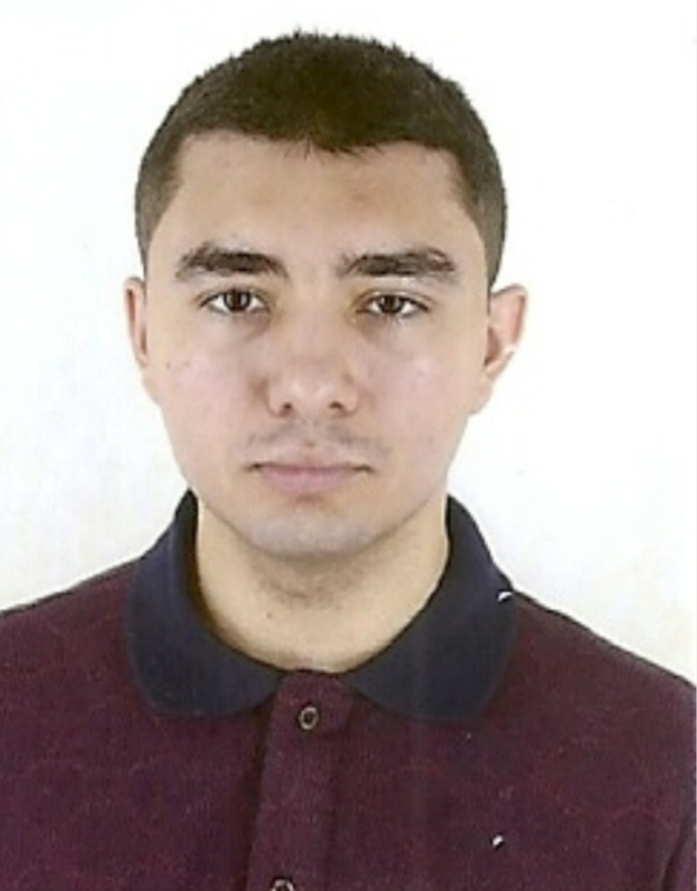
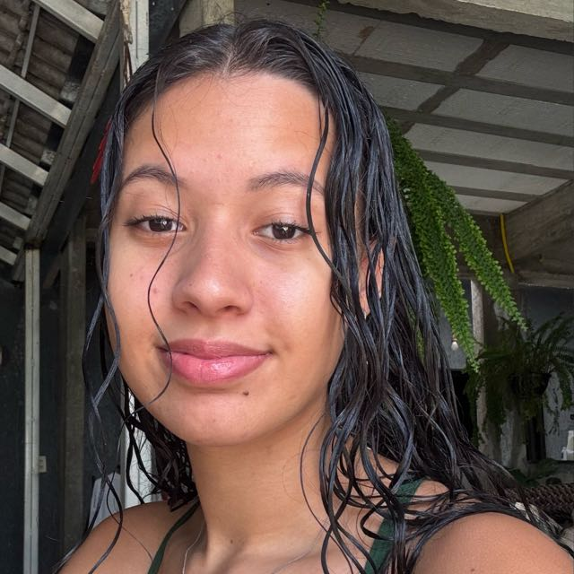

# Ibrada - Net

  

Esta é a documentação centralizada de requisitos de software para nosso projeto. Este site contém a documentação do projeto incluindo a Visão do Produto e Projeto, atas de reuniões e demais referências.

## Índice de Documentos

- [Visão do Produto e Projeto](documento-visao/1_cenarioAtual.md)
- [Cronograma](documento-visao/6_cronograma.md)

## Equipe

Equipe responsável pelo desenvolvimento do projeto de Engenharia de Requisitos.

<h3><a href="https://github.com/Ascartezin" target="_blank">Arthur Scartezini</a></h3>

<strong>Matrícula:</strong> 241025176

<h3><a href="https://github.com/cauamc2006-sketch">Cauã Mendes</a></h3>

<strong>Matrícula:</strong> 242032237

<h3><a href="https://github.com/filipeBG-07">Filipe Brito</a></h3>

<strong>Matrícula:</strong> 241031530

<h3><a href="https://github.com/gabriel-ggf">Gabriel Guedes</a></h3>

<strong>Matrícula:</strong> 232014656

<h3><a href="https://github.com/igorlym">Igor Lima</a></h3>

<strong>Matrícula:</strong> 241025953

<h3><a href="https://github.com/Vplayer-coder">Vinícius dos Santos</a></h3>

<strong>Matrícula:</strong> 211043772

<h3><a href="https://github.com/Zayra-Moraes">Zayra Moraes</a></h3>

<strong>Matrícula:</strong> 242015989

## 📚 [links](documentacao/glossario.md)

- [**GitHub da equipe**](https://github.com/mdsreq-fga-unb/REQ-2026.2-T01-IBRADA-NET) 
- [**Documento de Visão em PDF**](https://docs.google.com/document/d/1JuMdYhAhbbBK1ZZBhmm_-v7o6d5Aza8ZaxQL47o1ebc/edit?usp=sharing) 
- [**Gravações das reuniões**](https://youtube.com/playlist?list=PLOmJTo1E5Wyw&si=9lyK_hsuy6EZTuQn) 
- [**Teams da Equipe**](https://teams.microsoft.com/l/team/19%3A0dOSnB3AYm3zzQCzEALbv6DH-oHT9kyTA-W4dfta8WQ1%40thread.tacv2/conversations?groupId=36b1501e-47b5-4aa9-ae12-2e90ad821653&tenantId=ec359ba1-630b-4d2b-b833-c8e6d48f8059)

---

**Última atualização**: 07-09-2026

!!! note "Dica"
    Use o menu de navegação acima para explorar as diferentes seções da documentação.